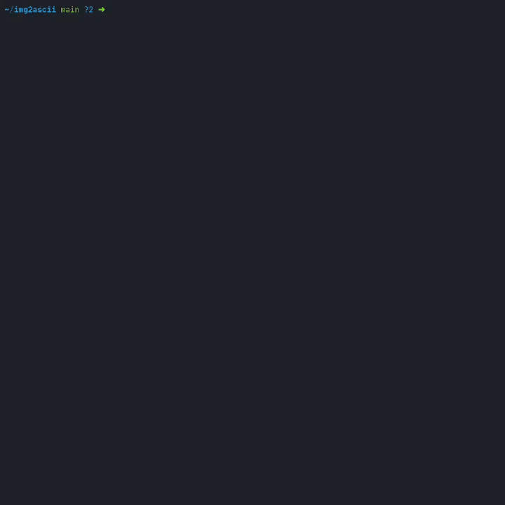

# img2ascii

A simple CLI tool to convert images to ascii text



## Command-line Options

### Flags:

- **-f**, **--fcolor**: color foreground
- **-b**, **--bcolor**: color background

### Options:

- **-r \<ramp>**, **--ramp \<ramp>**: specify the character ramp to be used for conversion
- **-s \<scale>**, **--scale \<scale>**: specify the scale to be used

## To Build

**img2ascii** is written in [Rust](https://www.rust-lang.org/). The Rust compiler can be installed by following the
instructions on the [official download page](https://www.rust-lang.org/tools/install).

```shell
$ git clone "https://github.com/edzdez/img2ascii.git"
$ cd img2ascii
$ cargo build --release
```
